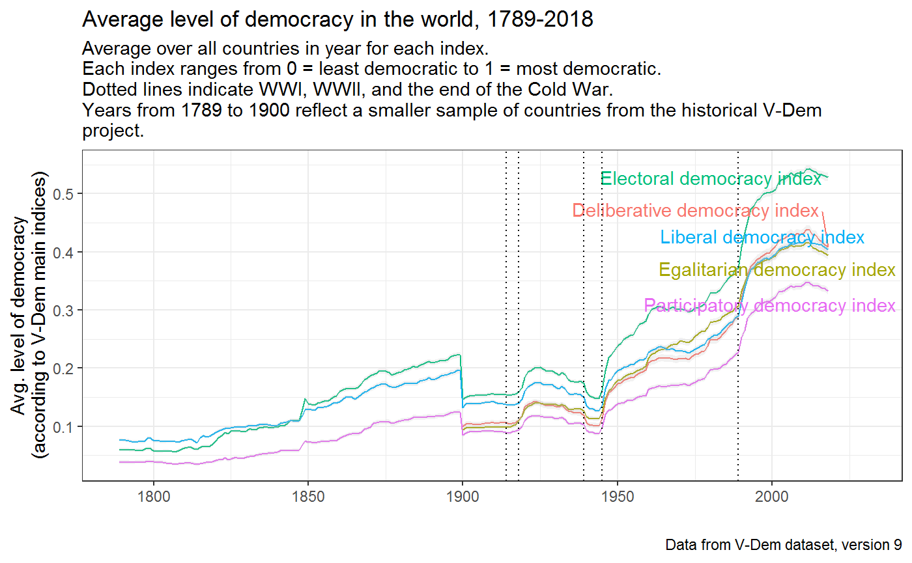

<!-- README.md is generated from README.Rmd. Please edit that file -->
<!-- badges: start -->

[](https://github.com/xmarquez/vdem/actions)
<!-- badges: end -->

# vdem

This package provides access to the [Varieties of Democracy (V-Dem)
dataset, version 11](https://www.v-dem.net/en/data/data-version-11/). It
includes the dataset’s codebook as a data frame, which allows one to
easily search for variables by label or other descriptors. And it also
includes a couple of convenience functions, `extract_vdem` and
`extract_vdem_filter`, to extract subsets of the dataset meeting
particular criteria.

## Installation

This package is only available on Github for now. Install as follows:

    remotes::install_github("xmarquez/vdem")

## Accessing the VDem dataset

You can access the entire V-Dem dataset by typing `VDem_plus`. (Access
documentation on the dataset by typing `?VDem_plus`, or typing
`vdem_codebook` to access the codebook as a data frame.).

## Extracting specific variables by label, section number, etc.

The V-Dem dataset is pretty big; including external variables and
identifiers, it has `27192` rows and `4188` columns, which takes up a
lot of memory and can be confusing to work with. This package thus makes
available the function `extract_vdem`, which allows you to extract a
subset of these variables meeting specific criteria. For example, you
can just extract the main democracy indices (described in section 2 of
the codebook) as follows:

``` r
library(vdem)

main_indices <- extract_vdem(section_number = 2)

main_indices
#> # A tibble: 27,192 x 105
#>    vdem_country_na~ vdem_country_te~ vdem_country_id  year extended_countr~
#>    <chr>            <chr>                      <dbl> <dbl> <chr>           
#>  1 Mexico           MEX                            3  1789 Mexico          
#>  2 Mexico           MEX                            3  1790 Mexico          
#>  3 Mexico           MEX                            3  1791 Mexico          
#>  4 Mexico           MEX                            3  1792 Mexico          
#>  5 Mexico           MEX                            3  1793 Mexico          
#>  6 Mexico           MEX                            3  1794 Mexico          
#>  7 Mexico           MEX                            3  1795 Mexico          
#>  8 Mexico           MEX                            3  1796 Mexico          
#>  9 Mexico           MEX                            3  1797 Mexico          
#> 10 Mexico           MEX                            3  1798 Mexico          
#> # ... with 27,182 more rows, and 100 more variables: GWn <dbl>,
#> #   historical_date <date>, project <dbl>, historical <dbl>, histname <chr>,
#> #   codingstart <dbl>, codingend <dbl>, codingstart_contemp <dbl>,
#> #   codingend_contemp <dbl>, codingstart_hist <dbl>, codingend_hist <dbl>,
#> #   gapstart1 <dbl>, gapstart2 <dbl>, gapstart3 <dbl>, gapend1 <dbl>,
#> #   gapend2 <dbl>, gapend3 <dbl>, gap_index <dbl>, vdem_cown <dbl>,
#> #   v2x_polyarchy <dbl>, v2x_libdem <dbl>, v2x_partipdem <dbl>,
#> #   v2x_delibdem <dbl>, v2x_egaldem <dbl>, v2x_api <dbl>, v2x_mpi <dbl>,
#> #   v2x_freexp_altinf <dbl>, v2x_frassoc_thick <dbl>, v2x_suffr <dbl>,
#> #   v2xel_frefair <dbl>, v2x_elecoff <dbl>, v2x_liberal <dbl>, v2xcl_rol <dbl>,
#> #   v2x_jucon <dbl>, v2xlg_legcon <dbl>, v2x_partip <dbl>, v2x_cspart <dbl>,
#> #   v2xdd_dd <dbl>, v2xel_locelec <dbl>, v2xel_regelec <dbl>,
#> #   v2xdl_delib <dbl>, v2x_egal <dbl>, v2xeg_eqprotec <dbl>,
#> #   v2xeg_eqaccess <dbl>, v2xeg_eqdr <dbl>, v2x_polyarchy_codelow <dbl>,
#> #   v2x_libdem_codelow <dbl>, v2x_partipdem_codelow <dbl>,
#> #   v2x_delibdem_codelow <dbl>, v2x_egaldem_codelow <dbl>,
#> #   v2x_api_codelow <dbl>, v2x_mpi_codelow <dbl>,
#> #   v2x_freexp_altinf_codelow <dbl>, v2x_frassoc_thick_codelow <dbl>,
#> #   v2xel_frefair_codelow <dbl>, v2x_liberal_codelow <dbl>,
#> #   v2xcl_rol_codelow <dbl>, v2x_jucon_codelow <dbl>,
#> #   v2xlg_legcon_codelow <dbl>, v2x_partip_codelow <dbl>,
#> #   v2x_cspart_codelow <dbl>, v2xel_locelec_codelow <dbl>,
#> #   v2xel_regelec_codelow <dbl>, v2xdl_delib_codelow <dbl>,
#> #   v2x_egal_codelow <dbl>, v2xeg_eqprotec_codelow <dbl>,
#> #   v2xeg_eqaccess_codelow <dbl>, v2xeg_eqdr_codelow <dbl>,
#> #   v2x_polyarchy_codehigh <dbl>, v2x_libdem_codehigh <dbl>,
#> #   v2x_partipdem_codehigh <dbl>, v2x_delibdem_codehigh <dbl>,
#> #   v2x_egaldem_codehigh <dbl>, v2x_api_codehigh <dbl>, v2x_mpi_codehigh <dbl>,
#> #   v2x_freexp_altinf_codehigh <dbl>, v2x_frassoc_thick_codehigh <dbl>,
#> #   v2xel_frefair_codehigh <dbl>, v2x_liberal_codehigh <dbl>,
#> #   v2xcl_rol_codehigh <dbl>, v2x_jucon_codehigh <dbl>,
#> #   v2xlg_legcon_codehigh <dbl>, v2x_partip_codehigh <dbl>,
#> #   v2x_cspart_codehigh <dbl>, v2xel_locelec_codehigh <dbl>,
#> #   v2xel_regelec_codehigh <dbl>, v2xdl_delib_codehigh <dbl>,
#> #   v2x_egal_codehigh <dbl>, v2xeg_eqprotec_codehigh <dbl>,
#> #   v2xeg_eqaccess_codehigh <dbl>, v2xeg_eqdr_codehigh <dbl>,
#> #   GW_startdate <date>, GW_enddate <date>, GWc <chr>, extended_region <chr>,
#> #   extended_continent <chr>, microstate <lgl>, lat <dbl>, lon <dbl>,
#> #   in_GW_system <lgl>
```

The function `extract_vdem` always returns a `tibble` with all the
identifiers in the dataset (country name, id, year, COW code, etc.) plus
the requested variables. (You will note that this table includes a
couple of identifiers I added, providing information about the
membership of the country-year in the
[Gleditsch-Ward](http://privatewww.essex.ac.uk/~ksg/statelist.html)
state system membership list). You can also specify whether you want the
measures of uncertainty included in the dataset (`_codehigh` and
`_codelow` confidence interval extremes) returned, or whether certain
variable types (e.g., ordinal-scale variables) should be excluded.

It is possible to extract variables whose labels mention certain words.
For example, you can extract all the variables that mention “corruption”
in the codebook labels:

``` r
corruption_vars <- extract_vdem(label_pattern = "corrupt")

corruption_vars
#> # A tibble: 27,192 x 63
#>    vdem_country_na~ vdem_country_te~ vdem_country_id  year extended_countr~
#>    <chr>            <chr>                      <dbl> <dbl> <chr>           
#>  1 Mexico           MEX                            3  1789 Mexico          
#>  2 Mexico           MEX                            3  1790 Mexico          
#>  3 Mexico           MEX                            3  1791 Mexico          
#>  4 Mexico           MEX                            3  1792 Mexico          
#>  5 Mexico           MEX                            3  1793 Mexico          
#>  6 Mexico           MEX                            3  1794 Mexico          
#>  7 Mexico           MEX                            3  1795 Mexico          
#>  8 Mexico           MEX                            3  1796 Mexico          
#>  9 Mexico           MEX                            3  1797 Mexico          
#> 10 Mexico           MEX                            3  1798 Mexico          
#> # ... with 27,182 more rows, and 58 more variables: GWn <dbl>,
#> #   historical_date <date>, project <dbl>, historical <dbl>, histname <chr>,
#> #   codingstart <dbl>, codingend <dbl>, codingstart_contemp <dbl>,
#> #   codingend_contemp <dbl>, codingstart_hist <dbl>, codingend_hist <dbl>,
#> #   gapstart1 <dbl>, gapstart2 <dbl>, gapstart3 <dbl>, gapend1 <dbl>,
#> #   gapend2 <dbl>, gapend3 <dbl>, gap_index <dbl>, vdem_cown <dbl>,
#> #   v2exbribe <dbl>, v2excrptps <dbl>, v2lgcrrpt <dbl>, v2jucorrdc <dbl>,
#> #   v2mecorrpt <dbl>, v3lgcrrpt <dbl>, v2xnp_regcorr <dbl>, v2x_corr <dbl>,
#> #   v2x_execorr <dbl>, v2x_pubcorr <dbl>, v2exbribe_codelow <dbl>,
#> #   v2excrptps_codelow <dbl>, v2lgcrrpt_codelow <dbl>,
#> #   v2jucorrdc_codelow <dbl>, v2mecorrpt_codelow <dbl>,
#> #   v3lgcrrpt_codelow <dbl>, v2xnp_regcorr_codelow <dbl>,
#> #   v2x_corr_codelow <dbl>, v2x_execorr_codelow <dbl>,
#> #   v2x_pubcorr_codelow <dbl>, v2exbribe_codehigh <dbl>,
#> #   v2excrptps_codehigh <dbl>, v2lgcrrpt_codehigh <dbl>,
#> #   v2jucorrdc_codehigh <dbl>, v2mecorrpt_codehigh <dbl>,
#> #   v3lgcrrpt_codehigh <dbl>, v2xnp_regcorr_codehigh <dbl>,
#> #   v2x_corr_codehigh <dbl>, v2x_execorr_codehigh <dbl>,
#> #   v2x_pubcorr_codehigh <dbl>, GW_startdate <date>, GW_enddate <date>,
#> #   GWc <chr>, extended_region <chr>, extended_continent <chr>,
#> #   microstate <lgl>, lat <dbl>, lon <dbl>, in_GW_system <lgl>
```

And here we extract variables that refer to civil society, including
“external” ones bundled with the dataset but not produced by the V-Dem
project itself:

``` r
civil_society <- extract_vdem(name_pattern = "^v2cl", 
                              label_pattern = "civil society", 
                              include_external = TRUE)

civil_society
#> # A tibble: 27,192 x 158
#>    vdem_country_na~ vdem_country_te~ vdem_country_id  year extended_countr~
#>    <chr>            <chr>                      <dbl> <dbl> <chr>           
#>  1 Mexico           MEX                            3  1789 Mexico          
#>  2 Mexico           MEX                            3  1790 Mexico          
#>  3 Mexico           MEX                            3  1791 Mexico          
#>  4 Mexico           MEX                            3  1792 Mexico          
#>  5 Mexico           MEX                            3  1793 Mexico          
#>  6 Mexico           MEX                            3  1794 Mexico          
#>  7 Mexico           MEX                            3  1795 Mexico          
#>  8 Mexico           MEX                            3  1796 Mexico          
#>  9 Mexico           MEX                            3  1797 Mexico          
#> 10 Mexico           MEX                            3  1798 Mexico          
#> # ... with 27,182 more rows, and 153 more variables: GWn <dbl>,
#> #   historical_date <date>, project <dbl>, historical <dbl>, histname <chr>,
#> #   codingstart <dbl>, codingend <dbl>, codingstart_contemp <dbl>,
#> #   codingend_contemp <dbl>, codingstart_hist <dbl>, codingend_hist <dbl>,
#> #   gapstart1 <dbl>, gapstart2 <dbl>, gapstart3 <dbl>, gapend1 <dbl>,
#> #   gapend2 <dbl>, gapend3 <dbl>, gap_index <dbl>, vdem_cown <dbl>,
#> #   v2cltort <dbl>, v2clkill <dbl>, v2clslavem <dbl>, v2clslavef <dbl>,
#> #   v2cltrnslw <dbl>, v2clrspct <dbl>, v2clacjstm <dbl>, v2clacjstw <dbl>,
#> #   v2clacjust <dbl>, v2clsocgrp <dbl>, v2clrgunev <dbl>, v2clsnlpct <dbl>,
#> #   v2cldiscm <dbl>, v2cldiscw <dbl>, v2clacfree <dbl>, v2clrelig <dbl>,
#> #   v2clfmove <dbl>, v2cldmovem <dbl>, v2cldmovew <dbl>, v2clstown <dbl>,
#> #   v2clprptym <dbl>, v2clprptyw <dbl>, v2clgencl <dbl>, v2clgeocl <dbl>,
#> #   v2clpolcl <dbl>, v2clrgstch_0 <dbl>, v2clrgstch_1 <dbl>,
#> #   v2clrgstch_2 <dbl>, v2clrgstch_3 <dbl>, v2clrgstch_4 <dbl>,
#> #   v2clrgstch_5 <dbl>, v2clrgstch_6 <dbl>, v2clrgstch_7 <dbl>,
#> #   v2clrgstch_8 <dbl>, v2clrgstch_9 <dbl>, v2clrgstch_10 <dbl>,
#> #   v2clrgstch_11 <dbl>, v2clrgstch_12 <dbl>, v2clrgstch_13 <dbl>,
#> #   v2clrgstch_14 <dbl>, v2clrgstch_15 <dbl>, v2clrgstch_16 <dbl>,
#> #   v2clrgstch_17 <dbl>, v2clrgstch_18 <dbl>, v2clrgstch_19 <dbl>,
#> #   v2clrgstch_20 <dbl>, v2clrgstch_21 <dbl>, v2clrgwkch_0 <dbl>,
#> #   v2clrgwkch_1 <dbl>, v2clrgwkch_2 <dbl>, v2clrgwkch_3 <dbl>,
#> #   v2clrgwkch_4 <dbl>, v2clrgwkch_5 <dbl>, v2clrgwkch_6 <dbl>,
#> #   v2clrgwkch_7 <dbl>, v2clrgwkch_8 <dbl>, v2clrgwkch_9 <dbl>,
#> #   v2clrgwkch_10 <dbl>, v2clrgwkch_11 <dbl>, v2clrgwkch_12 <dbl>,
#> #   v2clrgwkch_13 <dbl>, v2clrgwkch_14 <dbl>, v2clrgwkch_15 <dbl>,
#> #   v2clrgwkch_16 <dbl>, v2clrgwkch_17 <dbl>, v2clrgwkch_18 <dbl>,
#> #   v2clrgwkch_19 <dbl>, v2clrgwkch_20 <dbl>, v2clrgwkch_21 <dbl>,
#> #   v2cltort_codelow <dbl>, v2clkill_codelow <dbl>, v2clslavem_codelow <dbl>,
#> #   v2clslavef_codelow <dbl>, v2cltrnslw_codelow <dbl>,
#> #   v2clrspct_codelow <dbl>, v2clacjstm_codelow <dbl>,
#> #   v2clacjstw_codelow <dbl>, v2clacjust_codelow <dbl>,
#> #   v2clsocgrp_codelow <dbl>, v2clrgunev_codelow <dbl>,
#> #   v2clsnlpct_codelow <dbl>, ...
```

You can use any regular expression you like to search over the variable
names or label names. See `?extract_vdem` for all options.

If you need more control over the variables extracted, or need to learn
more about them, you can use the codebook:

``` r
vdem_codebook
#> # A tibble: 764 x 22
#>    section number name  label type  project_manager additional_vers~
#>      <int> <chr>  <chr> <chr> <chr> <chr>           <chr>           
#>  1       2 2.1.1  v2x_~ Elec~ (D)   Jan Teorell     *_codelow, *_co~
#>  2       2 2.1.2  v2x_~ Libe~ (D)   Jan Teorell     *_codelow, *_co~
#>  3       2 2.1.3  v2x_~ Libe~ (D)   Jan Teorell     *_codelow, *_co~
#>  4       2 2.1.4  v2x_~ Part~ (D)   Jan Teorell     *_codelow, *_co~
#>  5       2 2.1.5  v2x_~ Deli~ (D)   Jan Teorell     *_codelow, *_co~
#>  6       2 2.1.6  v2x_~ Egal~ (D)   Rachel Sigman,~ *_codelow, *_co~
#>  7       2 2.2.1  v2x_~ Addi~ (D)   Jan Teorell     *_codelow, *_co~
#>  8       2 2.2.2  v2x_~ Mult~ (D)   Jan Teorell     *_codelow, *_co~
#>  9       2 2.2.3  v2x_~ Free~ (D)   Svend-Erik Ska~ *_codelow, *_co~
#> 10       2 2.2.4  v2x_~ Free~ (D)   Allen Hicken, ~ *_codelow, *_co~
#> # ... with 754 more rows, and 15 more variables: available_versions <chr>,
#> #   question <chr>, clarification <chr>, responses <chr>, answer_type <chr>,
#> #   scale <chr>, ordering <chr>, aggregation <chr>, cross_coder <chr>,
#> #   data_release <chr>, source <chr>, cleaning <chr>, citation <chr>,
#> #   years <chr>, note <chr>
```

You can use the function `extract_vdem_filter` to exercise finer control
over the extraction process. For example, here we extract all variables
listed in section 2 of the codebook except component indices:

``` r
extract_vdem_filter(section == 2, !grepl("component index", label))
#> # A tibble: 27,192 x 93
#>    vdem_country_na~ vdem_country_te~ vdem_country_id  year extended_countr~
#>    <chr>            <chr>                      <dbl> <dbl> <chr>           
#>  1 Mexico           MEX                            3  1789 Mexico          
#>  2 Mexico           MEX                            3  1790 Mexico          
#>  3 Mexico           MEX                            3  1791 Mexico          
#>  4 Mexico           MEX                            3  1792 Mexico          
#>  5 Mexico           MEX                            3  1793 Mexico          
#>  6 Mexico           MEX                            3  1794 Mexico          
#>  7 Mexico           MEX                            3  1795 Mexico          
#>  8 Mexico           MEX                            3  1796 Mexico          
#>  9 Mexico           MEX                            3  1797 Mexico          
#> 10 Mexico           MEX                            3  1798 Mexico          
#> # ... with 27,182 more rows, and 88 more variables: GWn <dbl>,
#> #   historical_date <date>, project <dbl>, historical <dbl>, histname <chr>,
#> #   codingstart <dbl>, codingend <dbl>, codingstart_contemp <dbl>,
#> #   codingend_contemp <dbl>, codingstart_hist <dbl>, codingend_hist <dbl>,
#> #   gapstart1 <dbl>, gapstart2 <dbl>, gapstart3 <dbl>, gapend1 <dbl>,
#> #   gapend2 <dbl>, gapend3 <dbl>, gap_index <dbl>, vdem_cown <dbl>,
#> #   v2x_polyarchy <dbl>, v2x_libdem <dbl>, v2x_partipdem <dbl>,
#> #   v2x_delibdem <dbl>, v2x_egaldem <dbl>, v2x_api <dbl>, v2x_mpi <dbl>,
#> #   v2x_freexp_altinf <dbl>, v2x_frassoc_thick <dbl>, v2x_suffr <dbl>,
#> #   v2xel_frefair <dbl>, v2x_elecoff <dbl>, v2xcl_rol <dbl>, v2x_jucon <dbl>,
#> #   v2xlg_legcon <dbl>, v2x_cspart <dbl>, v2xdd_dd <dbl>, v2xel_locelec <dbl>,
#> #   v2xel_regelec <dbl>, v2xeg_eqprotec <dbl>, v2xeg_eqaccess <dbl>,
#> #   v2xeg_eqdr <dbl>, v2x_polyarchy_codelow <dbl>, v2x_libdem_codelow <dbl>,
#> #   v2x_partipdem_codelow <dbl>, v2x_delibdem_codelow <dbl>,
#> #   v2x_egaldem_codelow <dbl>, v2x_api_codelow <dbl>, v2x_mpi_codelow <dbl>,
#> #   v2x_freexp_altinf_codelow <dbl>, v2x_frassoc_thick_codelow <dbl>,
#> #   v2xel_frefair_codelow <dbl>, v2xcl_rol_codelow <dbl>,
#> #   v2x_jucon_codelow <dbl>, v2xlg_legcon_codelow <dbl>,
#> #   v2x_cspart_codelow <dbl>, v2xel_locelec_codelow <dbl>,
#> #   v2xel_regelec_codelow <dbl>, v2xeg_eqprotec_codelow <dbl>,
#> #   v2xeg_eqaccess_codelow <dbl>, v2xeg_eqdr_codelow <dbl>,
#> #   v2x_polyarchy_codehigh <dbl>, v2x_libdem_codehigh <dbl>,
#> #   v2x_partipdem_codehigh <dbl>, v2x_delibdem_codehigh <dbl>,
#> #   v2x_egaldem_codehigh <dbl>, v2x_api_codehigh <dbl>, v2x_mpi_codehigh <dbl>,
#> #   v2x_freexp_altinf_codehigh <dbl>, v2x_frassoc_thick_codehigh <dbl>,
#> #   v2xel_frefair_codehigh <dbl>, v2xcl_rol_codehigh <dbl>,
#> #   v2x_jucon_codehigh <dbl>, v2xlg_legcon_codehigh <dbl>,
#> #   v2x_cspart_codehigh <dbl>, v2xel_locelec_codehigh <dbl>,
#> #   v2xel_regelec_codehigh <dbl>, v2xeg_eqprotec_codehigh <dbl>,
#> #   v2xeg_eqaccess_codehigh <dbl>, v2xeg_eqdr_codehigh <dbl>,
#> #   GW_startdate <date>, GW_enddate <date>, GWc <chr>, extended_region <chr>,
#> #   extended_continent <chr>, microstate <lgl>, lat <dbl>, lon <dbl>,
#> #   in_GW_system <lgl>
```

And then you can easily use the data for your analyses or to make pretty
pictures:

``` r
library(tidyverse)
#> -- Attaching packages --------------------------------------- tidyverse 1.3.0 --
#> v ggplot2 3.3.3     v purrr   0.3.4
#> v tibble  3.0.5     v dplyr   1.0.2
#> v tidyr   1.1.2     v stringr 1.4.0
#> v readr   1.4.0     v forcats 0.5.0
#> -- Conflicts ------------------------------------------ tidyverse_conflicts() --
#> x dplyr::filter() masks stats::filter()
#> x dplyr::lag()    masks stats::lag()

data <- extract_vdem_filter(section == 2, !grepl("component index", label),
                            include_uncertainty = FALSE) %>%
  gather(index, index_value, v2x_polyarchy:v2x_egaldem) %>%
  select(vdem_country_name, vdem_country_id, year, index, index_value) %>%
  left_join(extract_vdem_filter(section == 2, !grepl("component index", label),
                            include_uncertainty = FALSE, include_sd = TRUE) %>%
              gather(sd, sd_value, v2x_polyarchy_sd:v2x_egaldem_sd) %>% 
              select(-v2x_polyarchy:-v2x_egaldem) %>%
  select(vdem_country_name, vdem_country_id, year, sd, sd_value)) %>%
  filter(index == stringr::str_replace(sd, "_sd","")) %>%
  left_join(vdem_codebook %>% 
              select(name, label) %>%
              rename(index = name)) %>%
  filter(!is.na(index)) %>%
  group_by(year, index) %>% 
  summarise(mean_index = mean(index_value, na.rm=TRUE), 
            se = sqrt(sum(sd_value^2, na.rm = TRUE))/n(),
            pct_025 = mean_index - 1.96*se,
            pct_975 = mean_index + 1.96*se,
            label = unique(label))
#> Joining, by = c("vdem_country_name", "vdem_country_id", "year")
#> Joining, by = "index"
#> `summarise()` regrouping output by 'year' (override with `.groups` argument)

library(ggrepel)  
ggplot(data) +
  geom_line(aes(x = year, y = mean_index, color = label), show.legend = FALSE) +
  geom_ribbon(aes(x = year, ymin = pct_025, ymax = pct_975, group = label), 
              fill = "grey", alpha = 0.2) +
  geom_text_repel(data = data %>% 
              filter(year == 2020),
            aes(x = year, y = mean_index, label = label, color = label), show.legend = FALSE) +
  theme_bw() +
    labs(y = "Avg. level of democracy\n(according to V-Dem main indices)",
         color = "", x = "",
         title = "Average level of democracy in the world, 1789-2020",
         subtitle = "Average over all countries in year for each index.\nEach index ranges from 0 = least democratic to 1 = most democratic.\nDotted lines indicate WWI, WWII, and the end of the Cold War.\nYears from 1789 to 1900 reflect a smaller sample of countries from the historical V-Dem\nproject.",
         caption = "Data from V-Dem dataset, version 11") +
  geom_vline(xintercept = c(1914, 1918, 1939, 1945, 1989), linetype = 3) +
  coord_cartesian(xlim = c(1789, 2030)) +
  scale_color_viridis_d()
#> Warning: Removed 222 row(s) containing missing values (geom_path).
```

<!-- -->

``` r
data <- extract_vdem_filter(section == 2, !grepl("component index", label),
                            include_uncertainty = FALSE) %>%
  gather(index, index_value, v2x_polyarchy:v2x_egaldem) %>%
  select(vdem_country_name, vdem_country_id, year, index, index_value) %>%
  left_join(extract_vdem_filter(section == 2, !grepl("component index", label)) %>%
              gather(codelow, codelow_value, v2x_polyarchy_codelow:v2x_egaldem_codelow) %>% 
              select(-v2x_polyarchy:-v2x_egaldem) %>%
  select(vdem_country_name, vdem_country_id, year, codelow, codelow_value)) %>%
  filter(index == stringr::str_replace(codelow, "_codelow",""))  %>%
  left_join(extract_vdem_filter(section == 2, !grepl("component index", label)) %>%
              gather(codehigh, codehigh_value, v2x_polyarchy_codehigh:v2x_egaldem_codehigh) %>% 
              select(-v2x_polyarchy:-v2x_egaldem) %>%
  select(vdem_country_name, vdem_country_id, year, codehigh, codehigh_value)) %>%
  filter(index == stringr::str_replace(codehigh, "_codehigh","")) %>%
  left_join(vdem_codebook %>% 
              select(name, label) %>%
              rename(index = name)) %>%
  filter(!is.na(index), 
         vdem_country_name %in% c("Venezuela", 
                                  "United States of America", 
                                  "Turkey", "Russia", "India"))
#> Joining, by = c("vdem_country_name", "vdem_country_id", "year")
#> Joining, by = c("vdem_country_name", "vdem_country_id", "year")
#> Joining, by = "index"

 
ggplot(data) +
  geom_line(aes(x = year, y = index_value, color = label), show.legend = FALSE) +
  geom_ribbon(aes(x = year, ymin = codelow_value, ymax = codehigh_value, group = label), 
              fill = "grey", alpha = 0.2) +
  geom_text_repel(data = data %>% 
              filter(year == 2020),
            aes(x = year, y = index_value, label = label, color = label), show.legend = FALSE) +
  theme_bw() +
    labs(y = "Avg. level of democracy\n(according to V-Dem main indices)",
         color = "", x = "",
         title = "Average level of democracy in selected countries, 1789-2020",
         subtitle = "Each index ranges from 0 = least democratic to 1 = most democratic.\nDotted lines indicate WWI, WWII, and the end of the Cold War.",
         caption = "Data from V-Dem dataset, version 11") +
  geom_vline(xintercept = c(1914, 1918, 1939, 1945, 1989), linetype = 3) +
  geom_hline(yintercept = 0.5, color = "red") +
  coord_cartesian(xlim = c(1789, 2030)) +
  facet_wrap(~vdem_country_name, ncol = 1) +
  scale_color_viridis_d()
#> Warning: Removed 222 row(s) containing missing values (geom_path).
```

<!-- -->
