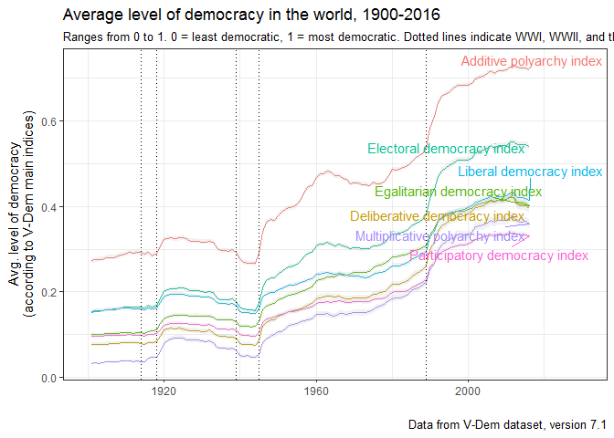
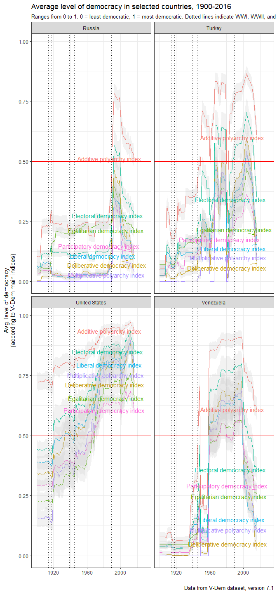

<!-- README.md is generated from README.Rmd. Please edit that file -->
[](https://travis-ci.org/xmarquez/vdem)

vdem
====

This package provides access to the [Varieties of Democracy (V-Dem) dataset, version 7.1](https://www.v-dem.net/en/data/data-version-7-1/). It includes the dataset's codebook as a data frame, which allows one to easily search for variables by label or other descriptors. And it also includes a couple of convenience functions, `extract_vdem` and `extract_vdem_filter`, to extract subsets of the dataset meeting particular criteria.

Installation
------------

This package is only available on Github for now. Install as follows:

    devtools::install_github("xmarquez/vdem")

You can access the entire V-Dem dataset by typing `VDem_plus`. (Access documentation on the dataset by typing `?VDem_plus`, or typing `vdem_codebook` to access the codebook as a data frame.).

The V-Dem dataset is pretty big; including external variables and identifiers, it has `17604` rows and `3614` columns, which takes up a lot of memory and can be confusing to work with. This package thus makes available the function `extract_vdem`, which allows you to extract a subset of these variables meeting specific criteria. For example, you can just extract the main democracy indices (described in section 1 of the codebook) as follows:

``` r
library(vdem)

main_indices <- extract_vdem(section_number = 1)

main_indices
#> # A tibble: 17,604 x 54
#>    vdem_country_name vdem_country_id vdem_country_text_id  year
#>                <chr>           <dbl>                <chr> <dbl>
#>  1       Afghanistan              36                  AFG  1900
#>  2       Afghanistan              36                  AFG  1901
#>  3       Afghanistan              36                  AFG  1902
#>  4       Afghanistan              36                  AFG  1903
#>  5       Afghanistan              36                  AFG  1904
#>  6       Afghanistan              36                  AFG  1905
#>  7       Afghanistan              36                  AFG  1906
#>  8       Afghanistan              36                  AFG  1907
#>  9       Afghanistan              36                  AFG  1908
#> 10       Afghanistan              36                  AFG  1909
#> # ... with 17,594 more rows, and 50 more variables: GW_country_name <chr>,
#> #   GWn <dbl>, historical_date <date>, codingstart <date>,
#> #   gapstart <date>, gapend <date>, codingend <date>, vdem_cown <dbl>,
#> #   v2x_polyarchy <dbl>, v2x_api <dbl>, v2x_mpi <dbl>, v2x_libdem <dbl>,
#> #   v2x_liberal <dbl>, v2x_partipdem <dbl>, v2x_partip <dbl>,
#> #   v2x_delibdem <dbl>, v2xdl_delib <dbl>, v2x_egaldem <dbl>,
#> #   v2x_egal <dbl>, v2x_polyarchy_codelow <dbl>, v2x_api_codelow <dbl>,
#> #   v2x_mpi_codelow <dbl>, v2x_libdem_codelow <dbl>,
#> #   v2x_liberal_codelow <dbl>, v2x_partipdem_codelow <dbl>,
#> #   v2x_partip_codelow <dbl>, v2x_delibdem_codelow <dbl>,
#> #   v2xdl_delib_codelow <dbl>, v2x_egaldem_codelow <dbl>,
#> #   v2x_egal_codelow <dbl>, v2x_polyarchy_codehigh <dbl>,
#> #   v2x_api_codehigh <dbl>, v2x_mpi_codehigh <dbl>,
#> #   v2x_libdem_codehigh <dbl>, v2x_liberal_codehigh <dbl>,
#> #   v2x_partipdem_codehigh <dbl>, v2x_partip_codehigh <dbl>,
#> #   v2x_delibdem_codehigh <dbl>, v2xdl_delib_codehigh <dbl>,
#> #   v2x_egaldem_codehigh <dbl>, v2x_egal_codehigh <dbl>,
#> #   GW_startdate <date>, GW_enddate <date>, GWc <chr>, region <chr>,
#> #   continent <chr>, lon <dbl>, lat <dbl>, microstate <lgl>,
#> #   in_GW_system <lgl>
```

The function `extract_vdem` always returns a `tibble` with all the identifiers in the dataset (country name, id, year, COW code, etc.) plus the requested variables. (You will note that this table includes a couple of identifiers I added, providing information about the membership of the country-year in the [Gleditsch-Ward](http://privatewww.essex.ac.uk/~ksg/statelist.html) state system membership list). You can also specify whether you want the measures of uncertainty included in the dataset (`_codehigh` and `_codelow` confidence interval extremes) returned, or whether certain variable types (e.g., ordinal-scale variables) should be excluded.

It is possible to extract variables whose labels mention certain words. For example, you can extract all the variables that mention "corruption" in the codebook labels:

``` r
corruption_vars <- extract_vdem(label_pattern = "corrupt")

corruption_vars
#> # A tibble: 17,604 x 45
#>    vdem_country_name vdem_country_id vdem_country_text_id  year
#>                <chr>           <dbl>                <chr> <dbl>
#>  1       Afghanistan              36                  AFG  1900
#>  2       Afghanistan              36                  AFG  1901
#>  3       Afghanistan              36                  AFG  1902
#>  4       Afghanistan              36                  AFG  1903
#>  5       Afghanistan              36                  AFG  1904
#>  6       Afghanistan              36                  AFG  1905
#>  7       Afghanistan              36                  AFG  1906
#>  8       Afghanistan              36                  AFG  1907
#>  9       Afghanistan              36                  AFG  1908
#> 10       Afghanistan              36                  AFG  1909
#> # ... with 17,594 more rows, and 41 more variables: GW_country_name <chr>,
#> #   GWn <dbl>, historical_date <date>, codingstart <date>,
#> #   gapstart <date>, gapend <date>, codingend <date>, vdem_cown <dbl>,
#> #   v2x_corr <dbl>, v2x_pubcorr <dbl>, v2x_execorr <dbl>, v2exbribe <dbl>,
#> #   v2excrptps <dbl>, v2lgcrrpt <dbl>, v2jucorrdc <dbl>, v2mecorrpt <dbl>,
#> #   v2x_corr_codelow <dbl>, v2x_pubcorr_codelow <dbl>,
#> #   v2x_execorr_codelow <dbl>, v2exbribe_codelow <dbl>,
#> #   v2excrptps_codelow <dbl>, v2lgcrrpt_codelow <dbl>,
#> #   v2jucorrdc_codelow <dbl>, v2mecorrpt_codelow <dbl>,
#> #   v2x_corr_codehigh <dbl>, v2x_pubcorr_codehigh <dbl>,
#> #   v2x_execorr_codehigh <dbl>, v2exbribe_codehigh <dbl>,
#> #   v2excrptps_codehigh <dbl>, v2lgcrrpt_codehigh <dbl>,
#> #   v2jucorrdc_codehigh <dbl>, v2mecorrpt_codehigh <dbl>,
#> #   GW_startdate <date>, GW_enddate <date>, GWc <chr>, region <chr>,
#> #   continent <chr>, lon <dbl>, lat <dbl>, microstate <lgl>,
#> #   in_GW_system <lgl>
```

And here we extract variables that refer to civil society, including "external" ones bundled with the dataset but not produced by the V-Dem project itself:

``` r
civil_society <- extract_vdem(name_pattern = "^v2cl", label_pattern = "civil society", include_external = TRUE)

civil_society
#> # A tibble: 17,604 x 143
#>    vdem_country_name vdem_country_id vdem_country_text_id  year
#>                <chr>           <dbl>                <chr> <dbl>
#>  1       Afghanistan              36                  AFG  1900
#>  2       Afghanistan              36                  AFG  1901
#>  3       Afghanistan              36                  AFG  1902
#>  4       Afghanistan              36                  AFG  1903
#>  5       Afghanistan              36                  AFG  1904
#>  6       Afghanistan              36                  AFG  1905
#>  7       Afghanistan              36                  AFG  1906
#>  8       Afghanistan              36                  AFG  1907
#>  9       Afghanistan              36                  AFG  1908
#> 10       Afghanistan              36                  AFG  1909
#> # ... with 17,594 more rows, and 139 more variables:
#> #   GW_country_name <chr>, GWn <dbl>, historical_date <date>,
#> #   codingstart <date>, gapstart <date>, gapend <date>, codingend <date>,
#> #   vdem_cown <dbl>, v2clacfree <dbl>, v2clrelig <dbl>, v2cltort <dbl>,
#> #   v2clkill <dbl>, v2cltrnslw <dbl>, v2clrspct <dbl>, v2clfmove <dbl>,
#> #   v2cldmovem <dbl>, v2cldmovew <dbl>, v2cldiscm <dbl>, v2cldiscw <dbl>,
#> #   v2clslavem <dbl>, v2clslavef <dbl>, v2clstown <dbl>, v2clprptym <dbl>,
#> #   v2clprptyw <dbl>, v2clacjstm <dbl>, v2clacjstw <dbl>,
#> #   v2clacjust <dbl>, v2clsocgrp <dbl>, v2clrgunev <dbl>,
#> #   v2clsnlpct <dbl>, v2clrgstch_0 <dbl>, v2clrgstch_1 <dbl>,
#> #   v2clrgstch_10 <dbl>, v2clrgstch_11 <dbl>, v2clrgstch_12 <dbl>,
#> #   v2clrgstch_13 <dbl>, v2clrgstch_14 <dbl>, v2clrgstch_15 <dbl>,
#> #   v2clrgstch_16 <dbl>, v2clrgstch_17 <dbl>, v2clrgstch_18 <dbl>,
#> #   v2clrgstch_19 <dbl>, v2clrgstch_2 <dbl>, v2clrgstch_20 <dbl>,
#> #   v2clrgstch_21 <dbl>, v2clrgstch_3 <dbl>, v2clrgstch_4 <dbl>,
#> #   v2clrgstch_5 <dbl>, v2clrgstch_6 <dbl>, v2clrgstch_7 <dbl>,
#> #   v2clrgstch_8 <dbl>, v2clrgstch_9 <dbl>, v2clrgwkch_0 <dbl>,
#> #   v2clrgwkch_1 <dbl>, v2clrgwkch_10 <dbl>, v2clrgwkch_11 <dbl>,
#> #   v2clrgwkch_12 <dbl>, v2clrgwkch_13 <dbl>, v2clrgwkch_14 <dbl>,
#> #   v2clrgwkch_15 <dbl>, v2clrgwkch_16 <dbl>, v2clrgwkch_17 <dbl>,
#> #   v2clrgwkch_18 <dbl>, v2clrgwkch_19 <dbl>, v2clrgwkch_2 <dbl>,
#> #   v2clrgwkch_20 <dbl>, v2clrgwkch_21 <dbl>, v2clrgwkch_3 <dbl>,
#> #   v2clrgwkch_4 <dbl>, v2clrgwkch_5 <dbl>, v2clrgwkch_6 <dbl>,
#> #   v2clrgwkch_7 <dbl>, v2clrgwkch_8 <dbl>, v2clrgwkch_9 <dbl>,
#> #   v2clacfree_codelow <dbl>, v2clrelig_codelow <dbl>,
#> #   v2cltort_codelow <dbl>, v2clkill_codelow <dbl>,
#> #   v2cltrnslw_codelow <dbl>, v2clrspct_codelow <dbl>,
#> #   v2clfmove_codelow <dbl>, v2cldmovem_codelow <dbl>,
#> #   v2cldmovew_codelow <dbl>, v2cldiscm_codelow <dbl>,
#> #   v2cldiscw_codelow <dbl>, v2clslavem_codelow <dbl>,
#> #   v2clslavef_codelow <dbl>, v2clstown_codelow <dbl>,
#> #   v2clprptym_codelow <dbl>, v2clprptyw_codelow <dbl>,
#> #   v2clacjstm_codelow <dbl>, v2clacjstw_codelow <dbl>,
#> #   v2clacjust_codelow <dbl>, v2clsocgrp_codelow <dbl>,
#> #   v2clrgunev_codelow <dbl>, v2clsnlpct_codelow <dbl>,
#> #   v2clacfree_codehigh <dbl>, v2clrelig_codehigh <dbl>,
#> #   v2cltort_codehigh <dbl>, v2clkill_codehigh <dbl>, ...
```

You can use any regular expression you like to search over the variable names or label names. See `?extract_vdem` for all options.

If you need more control over the variables extracted, or need to learn more about them, you can use the codebook:

``` r
vdem_codebook
#> # A tibble: 1,216 x 18
#>    section number          name                          label  type
#>      <int>  <chr>         <chr>                          <chr> <chr>
#>  1       1    1.1 v2x_polyarchy      Electoral democracy index   (D)
#>  2       1    1.2       v2x_api       Additive polyarchy index   (D)
#>  3       1    1.3       v2x_mpi Multiplicative polyarchy index   (D)
#>  4       1    1.4    v2x_libdem        Liberal democracy index   (D)
#>  5       1    1.5   v2x_liberal        Liberal component index   (D)
#>  6       1    1.6 v2x_partipdem  Participatory democracy index   (D)
#>  7       1    1.7    v2x_partip  Participatory component index   (D)
#>  8       1    1.8  v2x_delibdem   Deliberative democracy index   (D)
#>  9       1    1.9   v2xdl_delib   Deliberative component index   (D)
#> 10       1   1.10   v2x_egaldem    Egalitarian democracy index   (D)
#> # ... with 1,206 more rows, and 13 more variables: project_manager <chr>,
#> #   compiler <chr>, question <chr>, clarification <chr>, responses <chr>,
#> #   scale <chr>, aggregation <chr>, note <chr>, ordering <chr>,
#> #   cross_coder <chr>, source <chr>, data_release <chr>, citation <chr>
```

You can use the function `extract_vdem_filter` to exercise finer control over the extraction process. For example, here we extract all variables listed in section 1 of the codebook except component indices:

``` r
extract_vdem_filter(section == 1, !grepl("component index", label))
#> # A tibble: 17,604 x 42
#>    vdem_country_name vdem_country_id vdem_country_text_id  year
#>                <chr>           <dbl>                <chr> <dbl>
#>  1       Afghanistan              36                  AFG  1900
#>  2       Afghanistan              36                  AFG  1901
#>  3       Afghanistan              36                  AFG  1902
#>  4       Afghanistan              36                  AFG  1903
#>  5       Afghanistan              36                  AFG  1904
#>  6       Afghanistan              36                  AFG  1905
#>  7       Afghanistan              36                  AFG  1906
#>  8       Afghanistan              36                  AFG  1907
#>  9       Afghanistan              36                  AFG  1908
#> 10       Afghanistan              36                  AFG  1909
#> # ... with 17,594 more rows, and 38 more variables: GW_country_name <chr>,
#> #   GWn <dbl>, historical_date <date>, codingstart <date>,
#> #   gapstart <date>, gapend <date>, codingend <date>, vdem_cown <dbl>,
#> #   v2x_polyarchy <dbl>, v2x_api <dbl>, v2x_mpi <dbl>, v2x_libdem <dbl>,
#> #   v2x_partipdem <dbl>, v2x_delibdem <dbl>, v2x_egaldem <dbl>,
#> #   v2x_polyarchy_codelow <dbl>, v2x_api_codelow <dbl>,
#> #   v2x_mpi_codelow <dbl>, v2x_libdem_codelow <dbl>,
#> #   v2x_partipdem_codelow <dbl>, v2x_delibdem_codelow <dbl>,
#> #   v2x_egaldem_codelow <dbl>, v2x_polyarchy_codehigh <dbl>,
#> #   v2x_api_codehigh <dbl>, v2x_mpi_codehigh <dbl>,
#> #   v2x_libdem_codehigh <dbl>, v2x_partipdem_codehigh <dbl>,
#> #   v2x_delibdem_codehigh <dbl>, v2x_egaldem_codehigh <dbl>,
#> #   GW_startdate <date>, GW_enddate <date>, GWc <chr>, region <chr>,
#> #   continent <chr>, lon <dbl>, lat <dbl>, microstate <lgl>,
#> #   in_GW_system <lgl>
```

And then you can easily use the data for your analyses or to make pretty pictures:

``` r
library(tidyverse)
#> Loading tidyverse: ggplot2
#> Loading tidyverse: tibble
#> Loading tidyverse: tidyr
#> Loading tidyverse: readr
#> Loading tidyverse: purrr
#> Loading tidyverse: dplyr
#> Conflicts with tidy packages ----------------------------------------------
#> filter(): dplyr, stats
#> lag():    dplyr, stats

data <- extract_vdem_filter(section == 1, !grepl("component index", label),
                            include_uncertainty = FALSE) %>%
  gather(index, index_value, v2x_polyarchy:v2x_egaldem) %>%
  select(vdem_country_name, vdem_country_id, year, index, index_value) %>%
  left_join(extract_vdem_filter(section == 1, !grepl("component index", label),
                            include_uncertainty = FALSE, include_sd = TRUE) %>%
              gather(sd, sd_value, v2x_polyarchy_sd:v2x_egaldem_sd) %>% 
              select(-v2x_polyarchy:-v2x_egaldem) %>%
  select(vdem_country_name, vdem_country_id, year, sd, sd_value)) %>%
  filter(index == stringr::str_replace(sd, "_sd","")) %>%
  left_join(vdem_codebook %>% 
              select(name, label) %>%
              rename(index = name)) %>%
  filter(!is.na(index)) %>%
  group_by(year, index) %>% 
  summarise(mean_index = mean(index_value, na.rm=TRUE), 
            se = sqrt(sum(sd_value^2, na.rm = TRUE))/n(),
            pct_025 = mean_index - 1.96*se,
            pct_975 = mean_index + 1.96*se,
            label = unique(label))
#> Warning: attributes are not identical across measure variables;
#> they will be dropped

#> Warning: attributes are not identical across measure variables;
#> they will be dropped
#> Joining, by = c("vdem_country_name", "vdem_country_id", "year")
#> Joining, by = "index"

library(ggrepel)  
ggplot(data %>% filter(year > 1900)) +
  geom_line(aes(x = year, y = mean_index, color = label), show.legend = FALSE) +
  geom_ribbon(aes(x = year, ymin = pct_025, ymax = pct_975, group = label), 
              fill = "grey", alpha = 0.2) +
  geom_text_repel(data = data %>% 
              filter(year == 2016),
            aes(x = year, y = mean_index, label = label, color = label), show.legend = FALSE) +
  theme_bw() +
    labs(y = "Avg. level of democracy\n(according to V-Dem main indices)",
         color = "", x = "",
         title = "Average level of democracy in the world, 1900-2016",
         subtitle = "Ranges from 0 to 1. 0 = least democratic, 1 = most democratic. Dotted lines indicate WWI, WWII, and the end of the Cold War.",
         caption = "Data from V-Dem dataset, version 7.1") +
  geom_vline(xintercept = c(1914, 1918, 1939, 1945, 1989), linetype = 3) +
  coord_cartesian(xlim = c(1900, 2030))
```



``` r

data <- extract_vdem_filter(section == 1, !grepl("component index", label),
                            include_uncertainty = FALSE) %>%
  gather(index, index_value, v2x_polyarchy:v2x_egaldem) %>%
  select(vdem_country_name, vdem_country_id, year, index, index_value) %>%
  left_join(extract_vdem_filter(section == 1, !grepl("component index", label)) %>%
              gather(codelow, codelow_value, v2x_polyarchy_codelow:v2x_egaldem_codelow) %>% 
              select(-v2x_polyarchy:-v2x_egaldem) %>%
  select(vdem_country_name, vdem_country_id, year, codelow, codelow_value)) %>%
  filter(index == stringr::str_replace(codelow, "_codelow",""))  %>%
  left_join(extract_vdem_filter(section == 1, !grepl("component index", label)) %>%
              gather(codehigh, codehigh_value, v2x_polyarchy_codehigh:v2x_egaldem_codehigh) %>% 
              select(-v2x_polyarchy:-v2x_egaldem) %>%
  select(vdem_country_name, vdem_country_id, year, codehigh, codehigh_value)) %>%
  filter(index == stringr::str_replace(codehigh, "_codehigh","")) %>%
  left_join(vdem_codebook %>% 
              select(name, label) %>%
              rename(index = name)) %>%
  filter(!is.na(index), 
         vdem_country_name %in% c("Venezuela", 
                                  "United States", 
                                  "Turkey", "Russia"))
#> Warning: attributes are not identical across measure variables;
#> they will be dropped

#> Warning: attributes are not identical across measure variables;
#> they will be dropped
#> Joining, by = c("vdem_country_name", "vdem_country_id", "year")
#> Warning: attributes are not identical across measure variables;
#> they will be dropped
#> Joining, by = c("vdem_country_name", "vdem_country_id", "year")
#> Joining, by = "index"

 
ggplot(data) +
  geom_line(aes(x = year, y = index_value, color = label), show.legend = FALSE) +
  geom_ribbon(aes(x = year, ymin = codelow_value, ymax = codehigh_value, group = label), 
              fill = "grey", alpha = 0.2) +
  geom_text_repel(data = data %>% 
              filter(year == 2016),
            aes(x = year, y = index_value, label = label, color = label), show.legend = FALSE) +
  theme_bw() +
    labs(y = "Avg. level of democracy\n(according to V-Dem main indices)",
         color = "", x = "",
         title = "Average level of democracy in selected countries, 1900-2016",
         subtitle = "Ranges from 0 to 1. 0 = least democratic, 1 = most democratic. Dotted lines indicate WWI, WWII, and the end of the Cold War.",
         caption = "Data from V-Dem dataset, version 7.1") +
  geom_vline(xintercept = c(1914, 1918, 1939, 1945, 1989), linetype = 3) +
  geom_hline(yintercept = 0.5, color = "red") +
  coord_cartesian(xlim = c(1900, 2030)) +
  facet_wrap(~vdem_country_name, ncol = 1)
```


